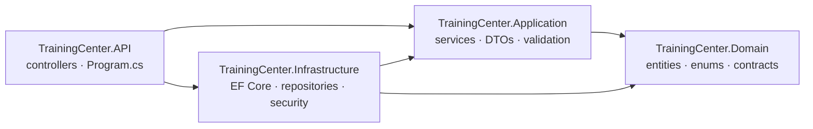

# 🏗️ Phase 04 — Task 04: Professional Architecture Refactor

The Training Center API is organised as a **four-project layered solution** (clean architecture) instead of one project with folders. The task pack's example structure is explicitly adaptable ("students can adapt the structure, but the project must be clean and predictable"), and this solution goes one step further: the layer boundaries are enforced by **project references**, so the compiler — not discipline — keeps controllers, business rules, and data access apart.

> **Architecture goal:** when a mentor opens the project, they should quickly understand where requests enter, where business rules live, where data is accessed, and how errors are handled.

| Question | Answer |
|----------|--------|
| **Where do requests enter?** | `TrainingCenter.API` — controllers, authentication, the middleware pipeline |
| **Where do business rules live?** | `TrainingCenter.Application` — services, validation, DTOs |
| **Where is data accessed?** | `TrainingCenter.Infrastructure` — EF Core, repositories, unit of work, migrations |
| **How are errors handled?** | Services return a `Result`; controllers map it to an HTTP status; anything unexpected hits the global exception handler in `Program.cs` |

---

## 📖 Table of Contents

- [Solution Structure](#-solution-structure)
- [Dependency Rule](#-dependency-rule)
- [Request Lifecycle](#-request-lifecycle)
- [Mapping to the Task 04 Required Layers](#-mapping-to-the-task-04-required-layers)
- [Why This Structure Is Better](#-why-this-structure-is-better)
- [API Response Standard](#-api-response-standard)
- [Error Handling](#-error-handling)
- [Key Design Decisions](#-key-design-decisions)
- [Configuration & Running](#-configuration--running)

---

## 🗂 Solution Structure

```
Task 00 - Phase 04 Sprint Setup.sln
│
├── TrainingCenter.Domain/                  ← the core: no project or NuGet dependencies
│   ├── Entities/            User, Student, Instructor, Admin, TrainingTrack, TrackSession,
│   │                        Enrollment, Payment, RefreshToken
│   ├── Enums/               Role, EnrollmentStatus, PaymentStatus, PaymentMethod,
│   │                        TrackLevel, TrackStatus
│   ├── Interfaces/
│   │   ├── IAudiable.cs, ISoftDelete.cs          (cross-cutting entity contracts)
│   │   └── Repositories/    IGenericRepository<T> + one interface per aggregate
│   └── Results/             Result, Result<T>, PagedResult<T>
│
├── TrainingCenter.Application/             ← business rules; depends only on Domain
│   ├── DTOs/                grouped by feature: Auth, User, Track, Enrollment, Payment, Report
│   │   └── <Feature>/       Requests/ and Responses/
│   ├── Interfaces/
│   │   ├── Persistence/     IUnitOfWork
│   │   └── Security/        IPasswordHasher, ITokenGenerator
│   ├── Services/
│   │   ├── Interfaces/      IAuthService, IStudentService, IInstructorService,
│   │   │                    ITrainingTrackService, IEnrollmentService, IPaymentService, IReportService
│   │   └── Implementations/ the seven matching services
│   ├── Validations/         AuthValidation, UserValidation, TrackValidation
│   └── Helpers/             PaymentCalculator, Models/Jwt (strongly-typed options)
│
├── TrainingCenter.Infrastructure/          ← everything that touches the outside world
│   ├── Data/                ApplicationDbContext (audit + soft-delete stamping)
│   ├── Configurations/      one IEntityTypeConfiguration<T> per entity
│   ├── Repositories/        GenericRepository<T> + one repository per aggregate
│   ├── UnitOfWork/          UnitOfWork (SaveAsync, transactions, execution strategy)
│   ├── Security/            BCryptPasswordHasher, JwtToken
│   └── Migrations/          EF Core migrations (schema history lives with persistence)
│
└── TrainingCenter.API/                     ← the HTTP surface and composition root
    ├── Controllers/         Auth, Students, Instructors, Tracks, Enrollments, Payments, Reports
    ├── Extensions/          AccessControlExtensions (current user, role + ownership guards)
    └── Program.cs           DI wiring, JWT auth, global exception handling, health checks, Swagger
```

---

## 🧭 Dependency Rule

Dependencies point **inward**, toward the domain:



| Project | May reference | Notes |
|---------|---------------|-------|
| **Domain** | nothing | No project references and no NuGet packages |
| **Application** | Domain | Cannot see `ApplicationDbContext`, BCrypt, or JWT types — it only knows the interfaces |
| **Infrastructure** | Application, Domain | Implements the interfaces the inner layers declare |
| **API** | Application, Infrastructure | References Infrastructure **only** so `Program.cs` can register the concrete implementations |

---

## 🔄 Request Lifecycle

Example: `PUT /api/enrollments/12/status` (an admin approving an enrollment).

1. **Pipeline (API)** — HTTPS redirection → JWT authentication validates issuer, audience, signature and lifetime (zero clock skew) → authorization.
2. **Controller (API)** — `[Authorize(Roles = "Admin")]` checks the role; the action validates the route/query parameters and, where needed, runs an ownership guard from `AccessControlExtensions`. It contains no business rules.
3. **Service (Application)** — `EnrollmentService` validates the transition, applies the business rules (e.g. allowed status changes), and calls repositories through `IUnitOfWork`.
4. **Repository / Unit of Work (Infrastructure)** — EF Core translates the call to SQL Server; `SaveAsync` commits.
5. **`ApplicationDbContext`** — stamps `CreatedAt`/`UpdatedAt` automatically on save.
6. **Back up the stack** — the service returns a `Result<EnrollmentDetailsResponse>` (a DTO, never an entity); the controller turns it into the HTTP status and the JSON body.
7. **Anything unexpected** — an unhandled exception is caught by the global handler: it is logged and the client receives a generic JSON `500`.

---

## 🗺 Mapping to the Task 04 Required Layers

| Task 04 layer | Where it lives | Notes |
|---------------|----------------|-------|
| `Controllers/` | `API/Controllers` | Seven resource-oriented controllers |
| `Services/` | `Application/Services` | Split into `Interfaces/` and `Implementations/` |
| `DTOs/` | `Application/DTOs/<Feature>/{Requests,Responses}` | Grouped by feature, then by direction |
| `Data/` | `Infrastructure/Data` | Plus `Configurations/`, `Repositories/`, `UnitOfWork/`, `Migrations/` — data access is split by responsibility rather than in one folder |
| `Entities/` | `Domain/Entities` | |
| `Middleware/` | Global exception handling via `UseExceptionHandler` in `API/Program.cs` | Built-in pipeline component instead of a custom middleware class |
| `Helpers/` | `Application/Helpers` | `PaymentCalculator` (single source of truth for payment status), `Jwt` options model |
| `Extensions/` | `API/Extensions` | `AccessControlExtensions` — current-user id, role checks, ownership guards, failure mapping |
| `Constants/` | `Domain/Enums` | Roles and statuses are enums (`Role`, `EnrollmentStatus`, `PaymentStatus`, `TrackStatus`, …) |
| `Validators/` or `Validation/` | `Application/Validations` | `AuthValidation`, `UserValidation`, `TrackValidation` |
| `Common/Responses/` | `Domain/Results` | `Result`, `Result<T>`, `PagedResult<T>` |
| *Bonus:* service-registration extensions | Not used | Services are registered in `Program.cs` |

---

## ⭐ Why This Structure Is Better

The task pack's example is one project with folders. That works, but nothing stops a controller from using `DbContext` directly, or a service from calling BCrypt. This solution makes those mistakes impossible rather than discouraged.

1. **Boundaries are enforced by the compiler.** The Application project has no reference to Infrastructure, so a service physically cannot instantiate `ApplicationDbContext`, BCrypt, or JWT classes. In a single project, that rule only lives in people's heads.
2. **Business rules are isolated and testable.** Services depend on `IUnitOfWork`, repository interfaces, `IPasswordHasher` and `ITokenGenerator` — never on concrete data or crypto code. A service can be exercised with fakes, without a database or an HTTP server.
3. **Infrastructure is replaceable and contained.** SQL Server/EF Core, BCrypt hashing, and JWT creation all live in one project. Changing the hashing algorithm or database provider touches Infrastructure only — not services, DTOs, or controllers.
4. **The domain has zero dependencies.** Entities, enums, repository contracts and result types compile with no NuGet packages at all, so the core of the system can't be broken by a library upgrade.
5. **Persistence has a single home.** Fluent configuration (one `IEntityTypeConfiguration<T>` per entity, applied by `ApplyConfigurationsFromAssembly`), repositories, the unit of work, and the migration history are all together; `OnModelCreating` stays tiny.
6. **Controllers are resource-oriented, not role-oriented.** The example structure suggests a controller per role (`AdminStudentsController`, `StudentPortalController`, …), which tends to duplicate the same workflow in several classes. Here there is one controller per resource; roles are expressed with `[Authorize(Roles = …)]` plus ownership guards, and the portal-style URLs from the task pack (`/api/student/...`, `/api/instructor/...`) are provided as route aliases.
7. **Cross-cutting rules have one owner.** Payment status is calculated in `PaymentCalculator` (this resolves the Phase 03 limitation about re-calculating it in several services); current-user and ownership logic is in `AccessControlExtensions`; results are created only through `Result` factory methods and are immutable.
8. **It is operationally ready, not just tidy.** Health check with a database probe (`/health`), EF Core retry-on-failure, pooled `DbContext`, migrations applied at startup with logging, Swagger restricted to Development/Staging, error detail only in Development, JWT settings through the options pattern, and refresh tokens stored only as hashes.
9. **A mentor can navigate it in minutes.** The four questions in the architecture goal map to four projects — the answer to "where does X live?" is always one folder away.

**Trade-off:** more projects and a few more interfaces than the single-project layout. At this size that's the cost of the guarantees above, and it keeps the solution ready to grow (new features, tests, or a second host) without restructuring.

---

## 📦 API Response Standard

Every service returns the same wrapper, so clients parse one shape:

```json
{
  "success": true,
  "message": "Students retrieved successfully.",
  "data": { "items": [ ], "totalCount": 42, "pageNumber": 1, "pageSize": 10, "totalPages": 5 },
  "errors": [],
  "statusCode": 200
}
```

```json
{
  "success": false,
  "message": "Validation errors",
  "errors": [ "Email is required.", "Password and confirm password do not match." ],
  "statusCode": 400
}
```

- `Result<T>` and `Result` have a private constructor and read-only properties — they can only be built through `SuccessResult` / `FailureResult`, which require a message and carry an explicit `StatusCode`.
- Lists use `PagedResult<T>` (`items`, `totalCount`, `pageNumber`, `pageSize`, computed `totalPages`).
- `null` values are omitted from JSON (`WhenWritingNull`), so a failure body has no `data` property; enums are serialized as readable strings.

---

## 🚨 Error Handling

| Kind of failure | Handled by | Client sees |
|-----------------|------------|-------------|
| Expected business/validation failure | The service returns `Result.FailureResult(message, errors, statusCode)` — no exceptions for control flow | The `Result` JSON with the matching HTTP status |
| Result → HTTP mapping | A single `FailureResponse` helper in `AccessControlExtensions` | `400`, `401`, `403`, `404`, `409`; anything else becomes `500` |
| Missing/invalid token | JWT authentication middleware | `401` |
| Wrong role, or not the owner | `[Authorize(Roles)]` / ownership guards | `403` |
| Unexpected exception | Global handler (`UseExceptionHandler` in `Program.cs`) | Generic JSON `500` — the exception is **logged** with method and path; the message is included **only in Development**; stack traces are never returned |

---

## 🧩 Key Design Decisions

- **Repository + Unit of Work.** `IGenericRepository<T>` (add, query with predicate/includes, count, exists, update, remove) with one specific repository per aggregate; `IUnitOfWork` exposes them, plus `SaveAsync`, transactions, and the EF execution strategy. Services stay free of `DbContext`.
- **Identity and ownership from the token.** Controllers read the current user from the `NameIdentifier` claim; role checks and ownership guards (`EnsureTrackAccessAsync`, `EnsureEnrollmentAccessAsync`) are shared helpers, so every controller applies the same rule the same way.
- **Security behind abstractions.** `IPasswordHasher` → `BCryptPasswordHasher`; `ITokenGenerator` → `JwtToken` (access token + random refresh token; refresh tokens stored SHA-256 hashed and rotated on use).
- **Entity contracts instead of base classes.** `IAudiable` (`CreatedAt`/`UpdatedAt`) and `ISoftDelete` (`IsDeleted`/`DeletedAt`) are stamped centrally in `ApplicationDbContext.SaveChangesAsync`.
- **Inheritance for identity.** `Student`, `Instructor` and `Admin` derive from `User`, so there is one login table and role-specific data stays on the right type.
- **Validation as plain static classes** in `Application/Validations`, returning readable error lists that feed straight into the `Result`.
- **DTOs on every boundary.** Controllers accept request DTOs and return response DTOs; password hashes and refresh-token hashes appear in none of them.

---

## ⚙️ Configuration & Running

**Prerequisites:** .NET 9 SDK, SQL Server.

**Settings** (`appsettings.*.json`, user-secrets, or environment variables):

| Key | Meaning |
|-----|---------|
| `ConnectionStrings:DefaultConnection` | SQL Server connection string (the app refuses to start without it) |
| `Jwt:Key` | Signing key — keep it out of source control; supply it via user-secrets or an environment variable such as `Jwt__Key` in production |
| `Jwt:Issuer` / `Jwt:Audience` | Validated on every token |
| `Jwt:AccessTokenExpiration` | Access-token lifetime in **minutes** |
| `Jwt:RefreshTokenExpiration` | Refresh-token lifetime in **days** |

**Run:**

```bash
cd TrainingCenter.API
dotnet run
```

On startup the app applies pending EF Core migrations (logged), then serves:

- Swagger UI — Development and Staging only
- `GET /health` — liveness plus a database check
